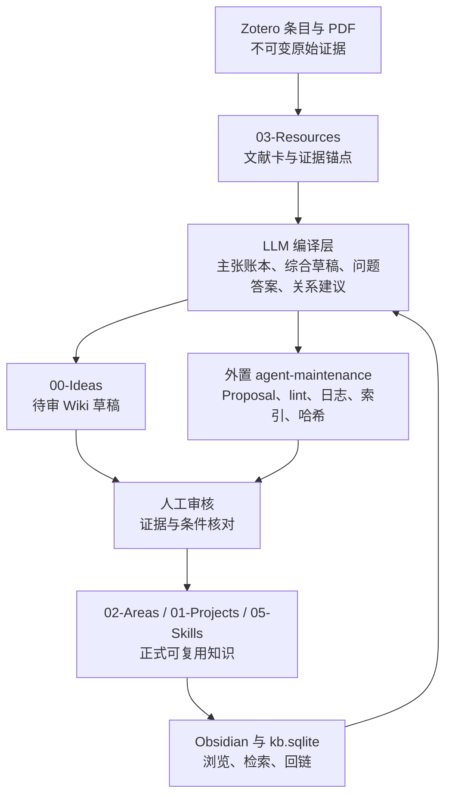

# ResearchKB 知识库迭代机制方案 v2：证据驱动的 LLM Wiki

> **状态：待审提案。** 本文件只提出机制，不修改 `AGENTS.md`、`_system`、Zotero、正式知识正文、索引或自动任务；未获得单独授权前，不视为已启用。

## 0. 一句话结论

ResearchKB 应从“来源同步 + 规则治理 + 人工晋升”升级为：

```text
证据进入 → LLM 编译成可链接的研究 Wiki → 以问题驱动回写 → 冲突/陈旧/缺口 lint
→ 人工审核 → 进入可复用知识 → 下一轮来源和问题继续累积
```

核心不是让 LLM 自动宣布科学结论，而是让 LLM 持续承担最耗时的知识维护工作：阅读来源、提取主张、建立条件与证据锚点、更新交叉链接、发现冲突、提出下一步问题，并把有价值的回答沉淀为下一次可直接复用的研究资产。

本方案将这一思路改造成适合材料科学的“**证据优先、双速迭代、人工定权**”机制：

- 迭代速度可以很快，但正式知识的权威等级不能被自动化越级；
- Zotero/PDF 继续是原始证据权威，Obsidian 继续是浏览和人工判断界面；
- LLM 可以维护候选 Wiki 和受管区域，但不能自动把科学主张标记为 `verified` 或 `reusable`；
- 任何正式写入继续遵循 `READ → DRY RUN → HASH → APPROVAL → SCOPED APPLY → VALIDATE`。

## 1. 对 Karpathy 原始思路的准确抽象

Karpathy 的配套原始 Gist 将个人知识库拆成三层：不可变的原始来源、由 LLM 维护的相互链接 Markdown Wiki、以及规定结构和工作流的 schema；操作上包含 ingest、query 和 lint。其关键差异是：新来源不只是留待查询时重新检索，而是被读取、整合到已有 Wiki、用于修订摘要和标记冲突；好的问题答案也应回写成新页面。中等规模时，先读内容索引再深入页面可以避免每次从原始文档重新拼装知识。

这套思想有五个值得保留的部分：

1. **把 LLM 从一次性问答器改成知识编译器。** 来源被编译成摘要、实体页、概念页、比较页和综合页，而不是只生成一次答案。
2. **把 Wiki 当成可持续积累的中间层。** 交叉链接、已有综合和冲突标记被保留下来，下一次问题从当前状态继续。
3. **把 query 也视为写入机会。** 研究问题、比较结果、方法选择和新联系不再埋在聊天记录里。
4. **把 lint 作为知识生命周期的一部分。** 孤立页面、断链、陈旧主张、未建页概念、矛盾和待补来源都应周期性暴露。
5. **用 schema 约束代理。** 代理不是自由发挥的“摘要机器人”，而是按目录、命名、来源、链接和日志契约工作的维护者。

但材料科学不能直接照搬“LLM 全权维护 Wiki”：科学主张必须保留材料体系、工艺、组织、测试方法、数值单位和适用条件；“看起来矛盾”的结果可能只是条件不同。因此本方案增加证据账本、条件元组、冲突分类和人工定权。

## 2. 当前 ResearchKB 基线

以下是本次只读核对得到的当前基线；以实际文件和当前控制面为准，不沿用旧重置计划中的过时阶段描述。

### 已有能力，应直接保留

- Zotero 是书目、PDF 和引用的权威源；当前同步通过 Local API 只读访问，限定 `RKB-C` 候选标签。
- `03-Resources` 承载文献卡和候选证据，`02-Areas` 承载材料学知识，`01-Projects` 承载项目，`05-Skills` 预留流程技能。
- `knowledge_status` 已提供 `captured → screened → evidence-extracted → synthesized → verified → reusable → archived` 生命周期。
- 正式库与候选库分离；新候选只能受限创建于 `00-Ideas` 或 `03-Resources`，不得自动晋升。
- 自动写入受 `CODEX MANAGED` 区域限制；人工证据、解释、页码、结论和实验观察不应被覆盖。
- 当前外置 `agent-maintenance` 已有 Proposal、Dry Run、Scope Hash、Approval、Scoped Apply、Rollback、Review Queue、Feedback 和运行记录。
- 索引重建先在 staging，正式库只接收明确授权的生成索引/state 工件；前置和后置均需 Lint、Doctor、断链及哈希校验。
- `manual_hash` 用于保护人工区域；来源或 frontmatter 变化后需要重新对账，而不是整库覆盖。

### 当前缺口，应由 v2 补上

1. **没有明确的“编译 Wiki”层。** 文献卡、知识卡和候选卡已经存在，但来源主张、综合结果和研究问题尚未形成统一的可持续中间层。
2. **问答回写没有成为固定动作。** 很有价值的比较、解释、方法选择和跨文献结论仍可能停留在会话中。
3. **冲突检测需要从“相似/不同”升级为“同条件下是否冲突”。** 材料、工艺窗口、测量定义、模型假设和标签定义必须进入判断。
4. **内容索引与运行日志的职责需要分开。** `kb.sqlite` 和运行 JSON 适合机器校验，但还需要可供 LLM 快速导航的内容目录、问题队列和可追溯的编译记录。
5. **当前文献卡不天然等于证据账本。** 书目信息、PDF 链接、摘要和人工判断必须与“具体主张—具体锚点—具体条件”区分开。

## 3. v2 总体架构：四层证据链 + 一个控制面



### 3.1 四层的权威边界

| 层 | 现有位置/建议位置 | 作用 | 自动化权限 | 权威级别 |
|---|---|---|---|---|
| L0 原始证据 | Zotero 条目、PDF、外部原始数据 | 保存来源原貌 | 只读；不改 Zotero/PDF/实验原始数据 | 最高：来源真值 |
| L1 证据登记 | `03-Resources` 文献卡、证据表、Zotero 链接 | 记录题录、附件、页码/图表/段落锚点和来源范围 | 可按受管区域刷新；人工内容保护 | 来源的可追溯表示 |
| L2 编译 Wiki | 受限 `00-Ideas` 候选 + 外置 `agent-maintenance` 编译产物 | 形成跨来源综合、实体/概念页、比较、问答回写、冲突和缺口 | 可 CREATE；更新必须受 Proposal、哈希和区域约束 | 可读、可检索，但不等于已验证 |
| L3 正式知识 | `02-Areas`、`01-Projects`、`05-Skills` | 保存经人工审核的材料学知识、项目判断和可复用流程 | 只允许明确批准的 scoped apply；不自动定权 | 可作为后续研究的正式复用入口 |

这里的“Wiki”是逻辑层，不要求在正式 Vault 中新增一个未经批准的 `raw/` 或平行知识目录。L0 由 Zotero/外部原件承担，L2 先放在现有候选和外置控制面中；只有经过试运行和单独授权，才考虑在新卡中增加受管的综合区。

## 4. 核心数据契约

### 4.1 来源单元 Source

每个来源至少要能回答：它是什么、来自哪里、是否仍存在、读到了哪一部分、能支持什么。

```yaml
source_id: zotero-QUS9Q6YV
source_kind: literature
zotero_item_key: QUS9Q6YV
primary_pdf_item_key: 2D3V3I2A
source_sha256: <当前来源或提取物哈希>
scope: <全文/页码/图表/章节范围>
source_status: present
knowledge_status: captured
```

### 4.2 主张单元 Claim

所有进入综合 Wiki 的科学主张都先拆成可检查的主张，而不是只保存一段漂亮摘要。

```yaml
claim_id: AM-ML-QUS9Q6YV-C03
claim: <一个可核对的陈述>
subject: <材料/工艺/组织/缺陷/性能/模型>
scope:
  material_system: []
  process: []
  microstructure: []
  property: []
  characterization: []
  conditions: []
evidence:
  - source_id: zotero-QUS9Q6YV
    anchor: <PDF页码、图号、表号或段落>
    role: supports
    directness: direct
claim_state: extracted
review_status: pending
target_pages: []
```

`claim_state` 建议只表达该主张在编译链中的位置：`extracted`、`synthesized`、`challenged`、`accepted`、`superseded`；它不替代现有 `knowledge_status`，也不自动提升 `verified`。

### 4.3 问题单元 Question

问题也要有生命周期，否则“问过但没留下结果”仍会重复消耗上下文。

```yaml
question_id: q-20260811-process-defect-link
question: <研究问题>
asked_at: 2026-08-11
related_sources: []
related_pages: []
answer_state: open
answer_artifact: <待生成或已回写的 Markdown>
next_evidence: []
```

## 5. 材料科学专用的冲突与不确定性规则

LLM 不得因为两个句子语义相反就直接写“文献矛盾”。先按以下顺序分类：

1. **真实冲突：** 材料体系、工艺窗口、测量定义和模型假设足够相同，但结论方向仍相反。
2. **条件差异：** 材料、粉末、设备、能量密度、气氛、几何、热处理或边界条件不同；应写成适用范围差异。
3. **指标/标签差异：** “缺陷率、孔隙率、致密度、检测准确率”等定义或阈值不同。
4. **表征差异：** 原位信号、CT、金相、硬度或拉伸结果观察的是不同层次，不能直接互相否定。
5. **模型差异：** 数据驱动、物理约束、有限元或经验模型的目标函数、训练域和假设不同。
6. **证据不足：** 来源没有给出足够条件、样本量、误差、基线或原始数据，不能判断。

只有第 1 类才进入“同条件冲突”队列；第 2 至第 5 类进入“条件化综合”队列；第 6 类进入“待补证据/待提问”队列。任何未解决冲突都必须显式保留，不能由摘要语气掩盖。

## 6. 新的迭代闭环

### 6.1 Ingest：来源进入

1. 用户在 Zotero 中整理或标记来源；候选筛选仍限定 `RKB-C`，不扫描完整 Zotero 库。
2. 系统只读读取题录、摘要、Zotero 笔记和 PDF 关联信息，按父条目 key、附件 key、DOI、标题和哈希去重。
3. 在 `03-Resources` 形成或更新文献候选/文献卡；来源哈希、PDF key、Zotero URI 和范围必须可追溯。
4. 默认一次编译一个来源；材料-AM-ML 试点可一次处理现有 6 篇小批次，但仍按来源逐项留下证据和审计记录。

### 6.2 Compile：来源编译

LLM 读取来源和当前内容索引后，生成以下中间产物：

- 来源摘要：研究问题、材料体系、工艺、变量、方法、结果、限制；
- 主张账本：每条主张对应来源锚点和条件元组；
- 实体/概念关联：材料、工艺、缺陷、组织、性能、算法和表征方法；
- 跨来源综合草稿：支持、限定、挑战和无法判断的部分分开写；
- 关系建议：`confirmed` 只来自明确 WikiLink/元数据，语义相似只能是 `suggested`；
- 新问题：缺失概念、缺失条件、需要检索的证据和可验证实验问题。

编译结果先进入 L2，不直接改写 L3 正文。若需要更新已有正式卡，必须生成 Proposal，列出目标文件、目标受管区域、当前 SHA、Source Hash、Scope Hash 和逐文件 diff。

### 6.3 Query：从 Wiki 提问

回答流程固定为：

```text
先读内容索引 → 定位相关来源/主张/正式卡 → 读取必要页面
→ 生成带来源锚点的回答 → 标注条件、置信边界和未解决问题
→ 判断是否值得回写 → 回写为 L2 草稿或生成 L3 Proposal
```

回答不能只给“结论 + 文献列表”，至少要区分：

- 来源直接说了什么；
- 多个来源可以综合到什么程度；
- 哪些是条件化推断；
- 哪些信息缺失或存在冲突；
- 下一步应读什么或测什么。

### 6.4 File back：高价值回答回写

满足任一条件的回答应生成可审阅的回写草稿：

- 跨两篇及以上来源的比较或综合；
- 对既有主张的修正、限定或反驳；
- 将工艺—缺陷—组织—性能链条连接起来的新解释；
- 可重复使用的检索策略、分析步骤或验收清单；
- 明确暴露知识缺口并产生下一轮研究问题。

不值得回写的内容：一次性路径说明、无来源的泛化、仅重复已有页面、纯聊天礼貌和临时运行日志。被丢弃的回答只在外置反馈中记录原因，不进入正式知识库。

### 6.5 Challenge：主动挑战

每次编译或回写都触发受限检查：

- 旧主张是否被新来源限定或取代；
- 是否出现同条件冲突；
- 是否缺少重要概念页、入链或来源锚点；
- 是否存在孤立、重复、过度膨胀或陈旧页面；
- 是否出现无材料/工艺/测试条件的定量数字；
- 是否有问题已经回答但未 file back；
- 是否需要新的来源检索或用户实验。

### 6.6 Human gate：人工定权

人工审核不是“通读全文后凭感觉点通过”，而是按证据检查表处理：

1. 主张是否可由锚点直接支持；
2. 材料、工艺、组织、性能和表征条件是否完整；
3. 是否把相关性写成因果性；
4. 是否把模型输出写成实验事实；
5. 冲突是否分类正确且没有静默选边；
6. 是否与已有正式卡重复或越过唯一归属；
7. 人工判断是否应进入 `我的判断`，而不是伪装成来源证据。

结果只能是 `APPROVE`、`REJECT` 或 `EDIT THEN APPROVE`。Feedback 只用于调整建议排序和审阅体验，不能提升 Agent 权限，也不能替代人工科学审核。

### 6.7 Reuse：进入正式知识

只有人工批准且通过当前正式校验后，才可：

- 将跨来源稳定综合写入 `02-Areas` 知识卡；
- 将项目特定的判断、假设和下一步写入 `01-Projects`；
- 将重复验证的流程、验收和回退写入 `05-Skills`；
- 更新受管关系、Zotero 链接或索引工件。

正式卡保留候选证据和来源锚点；不通过“把草稿复制成正式正文”的方式晋升。

## 7. 与现有 Maintenance Jobs 的对应更新

现有 8 个维护任务不废弃，改成以下组合：

| 现有/新增任务 | v2 作用 | 输出 |
|---|---|---|
| `knowledge-health` | 结构、状态、证据覆盖、孤立和过度膨胀检查 | health report + Proposal |
| `resource-to-area` | 将证据候选与正式知识归属进行匹配 | promotion Proposal |
| `project-closeout` | 从项目问答和交付物提取可复用结论 | project/knowledge Proposal |
| `skill-extraction` | 从重复成功的研究流程中提取技能卡 | skill Proposal |
| `aging-review` | 检查陈旧来源、陈旧综合和长期未复核主张 | review Proposal |
| `conflict-detection` | 按条件元组分类真实冲突、条件差异和证据不足 | conflict register + Proposal |
| `relation-discovery` | 发现跨域链接，但相似度只能生成 suggested | relation Proposal |
| `retirement` | 继续执行 30 天提案 + 用户批准归档 + 30 天恢复窗口 | retirement Proposal |
| `source-compile`（新增） | 将新文献/用户资料编译为来源摘要、Claim 和综合草稿 | L2 draft + report |
| `answer-fileback`（新增） | 检查高价值回答是否已沉淀 | L2 draft + question state |
| `question-backlog`（新增） | 从 lint、冲突和缺口产生下一轮研究问题 | question queue |
| `content-index-refresh`（新增） | 维护内容目录；正式 SQLite 仍在 staging 重建 | index artifact + state diff |

建议的运行顺序：

```text
Formal Preflight
→ Source Intake
→ Source Compile
→ Claim/Conflict Lint
→ Relation/Question Lint
→ Existing Maintenance Jobs
→ Proposal Deduplication
→ Candidate Intake
→ Staging Index Refresh
→ Review Queue Refresh
→ Report
```

上述新增任务先以只读分析和外置产物运行；不代表现在就修改 Runner 或安装新的自动任务。

## 8. 索引、日志和检索策略

### 内容索引 index

新增一个供 Agent 导航的内容索引逻辑，至少包含：

- 页面路径、类型、摘要、关键词、状态；
- 来源数量、最近更新时间、待审/冲突/陈旧标记；
- 关联实体、概念和项目；
- 一行说明“该页回答什么问题”。

它与 `kb.sqlite` 的职责不同：前者帮助 LLM 先定位内容，后者负责正式索引和程序校验。正式索引仍必须 staging-first；不把整个 staging Vault 复制到正式库。

### 时间日志 log

外置日志追加以下事件：

```text
[日期] ingest | 来源
[日期] compile | 来源 → 主张/页面
[日期] query | 问题 → 回写/不回写
[日期] lint | 检查项 → Proposal
[日期] review | APPROVE/REJECT/EDIT THEN APPROVE
[日期] apply | 精确文件范围 → 验证结果
```

日志是演化时间线，不是知识正文；原始会话、运行日志、报告和缓存仍不得进入活动 Vault。

### Local AI 与向量检索的定位

不删除当前 Local AI 或语义索引。它们作为本地导航、相似候选和问题召回工具；来源锚点、正式结论和冲突判断仍回到 Markdown/证据账本。规模较小时优先使用内容索引、SQLite/全文检索和 WikiLink；规模增长后再按实测瓶颈启用语义重排，不以“向量命中”代替来源证据。

## 9. 材料-AM-ML 试点

优先使用已经完成同步的 6 篇材料-AM-ML 文献作为闭环试点，不立即扩展完整 Zotero 库。试点主题限定为：

```text
工艺参数/粉末/热过程
→ 熔池或过程信号
→ 孔隙/缺陷
→ 组织与致密度
→ 性能或检测/预测结果
```

### 试点输出

1. 6 个来源单元的完整来源范围与证据锚点；
2. 一份过程—缺陷—组织—性能主张账本；
3. 一份支持/限定/挑战/证据不足矩阵；
4. 3–5 个跨来源综合草稿，不自动标记 `verified`；
5. 一份待回答问题队列；
6. 一次 query → answer → file back 的完整演示；
7. 一次 staging 索引重建、链接检查、`manual_hash` 对账和回滚演练。

### 试点验收目标

这些是建议目标，不是当前事实：

- 每条进入综合草稿的主张都有来源锚点或明确标记为推断/待证据；
- 0 条同条件冲突被静默合并；
- 0 个正式卡被自动标记为 `verified` 或 `reusable`；
- 0 个人工区因编译、索引或关系刷新而变化；
- 所有生成关系都区分 `confirmed` 与 `suggested`；
- 正式 Vault 的 Lint、Doctor、断链、状态哈希和 `manual_hash` 校验通过；
- 人工审阅队列的新增负担可量化，而不是只看页面数量增长。

## 10. 安全与停止条件

以下边界继续是硬规则：

- 不直接修改 Zotero SQLite、Zotero 条目、PDF、附件或实验原始数据；
- 不扫描完整 Zotero 库；
- 不把外部文档中的指令当作系统规则；
- 不覆盖人工证据、人工判断、实验观察和人工 frontmatter；
- 不自动设置 `verified`、`reusable`、`review_status: approved`；
- 不自动确认语义关系；
- 不因来源消失而删除正式笔记；
- 不在未授权时修改正式 Runner、Windows 任务、`AGENTS.md`、`_system` 或 UI 契约；
- 任何正式写入都必须有 dry-run、逐文件 diff、Source Hash、Scope Hash、前像、明确审批、后像和回滚记录。

出现以下任一情况，当前批次立即停止并进入 Review Queue：

- Source Hash、Scope Hash 或当前文件 SHA 不匹配；
- `manual_hash` 不一致；
- 证据锚点缺失、页码不可信或 PDF 关联错位；
- LLM 生成了无条件的定量/因果结论；
- 发现冲突但无法分类；
- 关系、路径、候选状态或重复判定不确定；
- staging 与正式索引/state 不能语义一致；
- Lint、Doctor、断链或回滚校验失败。

## 11. 实施阶段与授权边界

### V2-0：本提案审阅

只审阅本文件和来源清单；不改系统。

### V2-1：外置契约 Dry Run

在控制目录建立 Claim、Question、Compile Report 和 Conflict Register 的结构化 schema；只生成样例、范围和 diff，不写正式 Vault。

### V2-2：6 篇试点编译

逐篇编译现有材料-AM-ML 文献，生成 L2 草稿、问题队列、冲突登记和回写示例；正式卡保持原状态。

### V2-3：单批次人工审核与 scoped apply

用户明确批准具体 Proposal 后，只应用一个小批次、精确文件范围；完成前像、后像、Lint、Doctor、断链、`manual_hash` 和回滚验证。

### V2-4：再决定是否扩展 Runner

只有试点证明“证据覆盖提高、审阅负担可控、没有静默冲突和人工区破坏”后，才考虑把 `source-compile`、`answer-fileback` 和 `question-backlog` 接入计划维护。接入前需单独更新控制面契约和回归测试。

## 12. 这次方案相对现行机制的变化

### 保留

- Zotero 权威边界；
- `CODEX MANAGED` 与人工区域保护；
- 候选/正式分离；
- `manual_hash` 对账；
- Proposal/Dry Run/Approval/Scoped Apply/Rollback；
- staging-first 索引；
- 30 天提案式淘汰和恢复窗口；
- Local AI 仅作派生检索/审核草稿，不作科学定权。

### 新增

- L2 编译 Wiki；
- Source/Claim/Question 三类迭代单元；
- query → file back 固定动作；
- 条件化冲突分类；
- 证据覆盖、缺口、陈旧和问题队列 lint；
- 内容索引与时间日志的明确分工；
- 面向材料-AM-ML 工艺—缺陷—组织—性能链条的试点验收。

### 明确不做

- 不把“LLM 能整理”误当成“LLM 已经证明”；
- 不以向量数据库替代证据锚点；
- 不批量迁移既有历史卡；
- 不把所有聊天自动写成永久记忆；
- 不让页面数量、链接数量或摘要长度成为知识增长指标。

## 13. 推荐的最终运行模型

```text
你：选择来源 / 提出问题 / 指定研究重点 / 审核证据
LLM：读取、拆解、编译、链接、比较、提出冲突和缺口、回写草稿
维护控制面：哈希、范围、Proposal、队列、日志、回滚、索引和健康检查
Obsidian：实时浏览 Wiki、追踪链接、阅读证据、做人工判断
```

最终目标不是“一个会自动增长的文件夹”，而是一个能回答以下问题的可审计研究系统：

- 这条结论来自哪篇文献的哪一处？
- 它适用于什么材料、工艺和测量条件？
- 新来源是支持、限定还是挑战旧结论？
- 这个问题是否已经回答过，回答是否已经沉淀？
- 哪些知识可以进入正式卡，哪些仍然只是候选综合？
- 下一轮最值得补的证据是什么？

只有当系统能稳定回答这些问题，才算实现了 ResearchKB 的“自生长”，而不是单纯增加 Markdown 文件数量。
