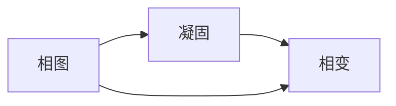

# 相图—凝固—相变：自动关系图

> 本图只汇总系统管理的自动卡；每个节点都必须回溯 Curated 与原始来源，不能替代人工核验。

<!-- BEGIN CODEX MANAGED: FOUNDATION GRAPH -->

```mermaid
flowchart LR
  phase["相图"] --> solid["凝固"]
  solid --> transform["相变"]
  phase --> transform
```

## 节点卡片

- 暂无来源完整的自动学习卡。

<!-- END CODEX MANAGED: FOUNDATION GRAPH -->
