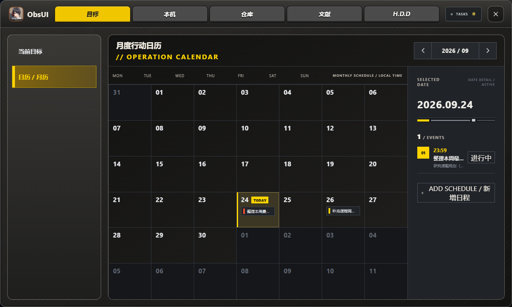

# ObsUI

ObsUI 是运行在 Windows 本机的科研工作台，将目标日程、文献阅读、知识仓库、AI 对话和设备状态集中在同一个界面。ResearchKB 知识库与自动化也保留在这个仓库中，供工作台使用。



*目标月历实机截图；使用全新浏览器中的示例任务，不含个人文献、网络地址或账号数据。*

## ObsUI 能做什么

- **目标与月历：** 管理任务、截止时间和完成状态；在月历中选择日期查看详情，通过“新增日程”创建任务。
- **文献工作台：** 扫描本地 PDF，结合 Zotero 条目整理文献，进行重复检查、阅读和本地模型辅助翻译；写入 Zotero 前由用户确认。
- **仓库与笔记：** 浏览 Git 仓库、素材目录和 Obsidian Vault；查看或编辑 Markdown，并用关系图谱探索仓库、目录及笔记之间的联系。
- **H.D.D 对话：** 在受控知识范围内调用 Codex CLI、本机 Ollama 或受信任的其他 CLI；模型和思考强度按实际能力选择。
- **本机状态：** 显示硬件传感器、网络、天气和 Codex 额度；可选接入 HWiNFO、Zotero、Ollama 等本机程序，缺失数据会标为不可用。
- **设置与数据：** 管理工作台外观、启动应用和本地模型；项目与任务保存在浏览器本地，可导出和导入 JSON。

## 启动 ObsUI

```powershell
Set-Location apps\ObsUI
pnpm install --frozen-lockfile
pnpm dev
```

打开 `http://127.0.0.1:5173/?ui=tab-v2`。应用源码和配置说明见 [ObsUI 说明](apps/ObsUI/README.md)，跨电脑安装与数据恢复见 [Windows 新电脑迁移指南](docs/migration-windows.md)。HWiNFO、Ollama、Zotero 及本地模型需要在每台电脑上分别安装或配置；仓库不包含这些程序、模型权重和本机凭据。

## 本仓库包含的内容

- ObsUI 应用源码、测试与界面资源：`apps/ObsUI/`。
- 知识库目录结构与协作规则：`AGENTS.md`、`00-Ideas` 至 `05-Skills`。
- 自动化配置、任务脚本、测试和文档：`.harness/`。
- 知识卡模板与 Schema：`_system/templates`、`_system/schema.md`。
- 可共享的 Obsidian 基础设置：`.obsidian/*.json`。
- 运行 GitHub/X 信号桥接器所需的 MIT 许可 Horizon 源码快照与依赖锁定文件。

本仓库按所有者的跨电脑迁移要求，包含个人知识目录及其附件、ObsUI 当前源码与运行所需资源、已导出的 ObsUI 使用数据和自动化状态。仓库公开可见，提交前须检查凭据与本机配置；运行日志、缓存、依赖、Obsidian 插件二进制及工作区外的 Zotero/PDF 数据不上传。

**换电脑恢复完整工作项目：** 请按 [Windows 新电脑迁移指南](docs/migration-windows.md) 安装依赖、导入 ObsUI 使用数据并配置本机凭据。仅 `git clone` 不会自动恢复浏览器数据库，也不会安装外部软件。

## ResearchKB 知识库与自动化

```powershell
git clone https://github.com/youyuaeiou-netizen/ResearchKB.git
Set-Location ResearchKB
codex
```

在 Codex 中打开本目录即可读取 `AGENTS.md`。任务会从自身位置定位工作区；不要求克隆到特定盘符或用户名目录。

基础任务需要 PowerShell 7 与 Python 3.11+。`Resolve-ResearchKBPython.ps1` 会优先发现 Codex 自带 Python；也可显式设置 `RESEARCHKB_PYTHON` 为 `python.exe` 路径。只有显式使用 `-Codex` 的候选编译才需要本机可用的 `codex` CLI。

```powershell
& 'C:\Program Files\PowerShell\7\pwsh.exe' -NoLogo -NoProfile -File .harness\tasks\run-knowledge-lifecycle-weekly.ps1 -NoWrite
```

完整的首次离线运行见 [中文快速开始](docs/quickstart-zh.md)，架构和自动流转边界见 [架构说明](docs/architecture.md)。

## 自动化边界

- 不新增计划任务。现有 Horizon 周报任务在周报成功后调用既有 `run-researchkb-weekly.ps1`；该入口依次运行 Curated、基础学习、usage、upgrade 和 Areas 阶段。
- 所有 Horizon 四类动态均可进入候选；不能映射至当前学习主题的内容保留为“扩展探索”，不当作基础科学事实。
- 自动写入仅限 `CODEX MANAGED` 区域和 `02-Areas/_Codex-Auto`；不会覆盖既有人工 Areas、Zotero、PDF 或 `.obsidian`。
- 网络抓取需要有效本地凭据，并受当前 Horizon 配置的预算闸门约束；CI 只使用本地夹具，不发起付费采集。

## 开发与测试

在 Windows PowerShell 7 中执行：

```powershell
python -m pip install -r .harness\requirements-test.txt
python -m unittest discover -s .harness\tests -v
& 'C:\Program Files\PowerShell\7\pwsh.exe' -NoLogo -NoProfile -File .harness\tasks\run-researchkb-weekly.ps1 -NoWrite
```

使用分支和 Pull Request 提交更改；贡献方式、安全报告和支持渠道见 [CONTRIBUTING.md](CONTRIBUTING.md)、[SECURITY.md](SECURITY.md) 与 [SUPPORT.md](SUPPORT.md)。

## 可选本地集成

Horizon GitHub/X 信号采集需要其独立 Python 环境，且默认不会联网。若确有经审核的来源与相应权限，请先安装 `uv`，再执行：

```powershell
uv sync --project .harness/vendor/Horizon --extra twitter
Copy-Item .harness/secrets/horizon.env.example .harness/secrets/horizon.env
```

仅在 `horizon.env` 中填写可选的 `RESEARCHKB_GITHUB_TOKEN` 与 `APIFY_TOKEN`；该文件被 Git 忽略。运行前先使用 `run-horizon-fetch.ps1` 的默认 dry-run，联网和正式 Vault 写入都需要明确授权。

如需启用本机 Zotero/Obsidian/运行目录，复制并填写 `_system/external_paths.example.json` 为 `_system/external_paths.json`。该本地文件同样不会提交。

## 安全边界

- 自动化默认 dry-run，只能改写带有 `CODEX MANAGED` 标记的区域。
- Zotero Local API 仅只读；不直接修改 Zotero 数据库。
- 采集失败、来源冲突或证据不足时保持 `hold`，而非将候选提升为正式知识。
- `--apply`、归档及任何外部访问都必须获得当前操作者的明确授权。

## 第三方组件

`.harness/vendor/Horizon` 保留其上游 MIT 许可文本。其虚拟环境、数据目录和内部 Git 元数据不会被版本控制。
